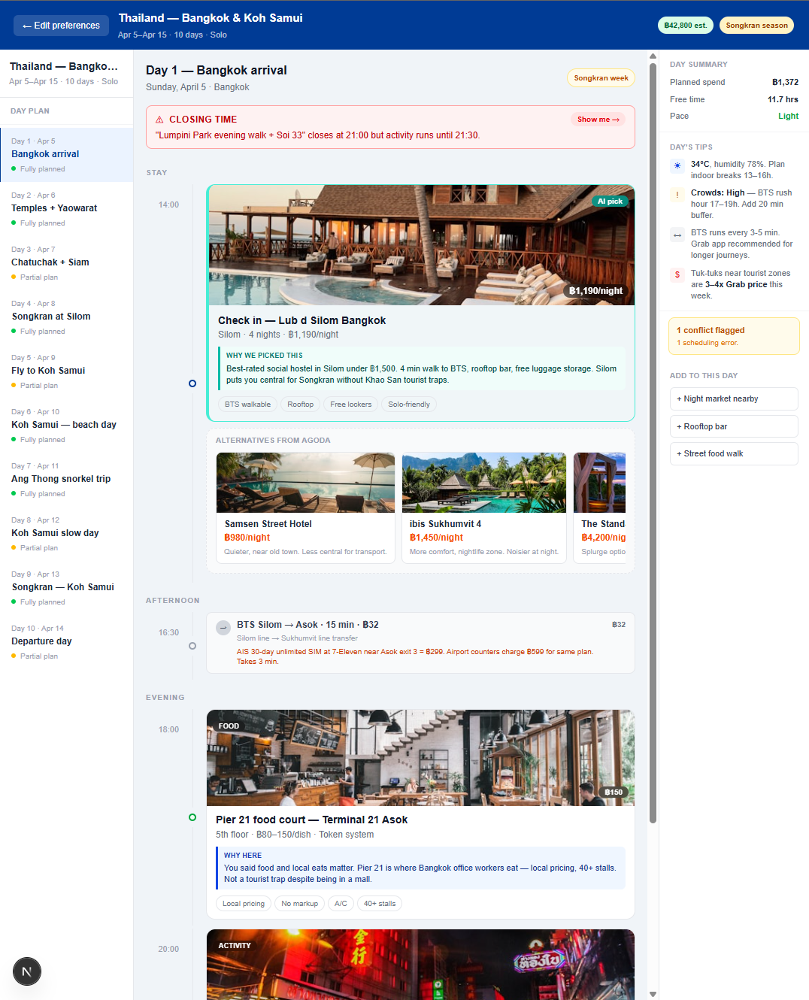

# Trip Planner

A conversational trip planning side project. Designed for experienced travellers who start with destinations and activities, then figure out hotels and logistics around that — not the other way around.

Built with Next.js 16, React 19, TypeScript, Tailwind CSS v4, and the Anthropic Claude API.

---

## Screenshots

**Chat Onboarding — Meet Pete**


**Itinerary Planner**


---

## What it does

Two screens, one flow:

**Screen 1 — Chat onboarding**
A conversation with Pete, a friendly and knowledgeable trip planning assistant. Pete asks about destination, dates, who's travelling, travel style, activities, and budget — one question at a time. MCQ buttons handle structured inputs (traveller type, style, budget) with auto-send on tap. Activities use multi-select with a confirm step. The "Build plan" button only appears once the three required fields are filled: destination, dates, and traveller type.

**Screen 2 — Itinerary planner**
A day-by-day itinerary with three panels:
- **Left — Day Plan**: day navigation with status indicators (fully planned / partial / not planned)
- **Centre — Timeline**: drag-and-drop stop reordering with cascading time recalculation, a 24-hour proportional timeline with hour tick marks, and click-to-add on blank space
- **Right — Intel Panel**: day spend, free time, pace, day's tips (weather, crowds, transit), conflict count, suggestions, and a persistent Pete chat in the bottom half

Each hotel card shows a hero image, an AI pick / Your choice source badge, a "Why we picked this" reasoning block, and a horizontally scrollable alternatives strip. Swapping a hotel updates the image, price, and reasoning immediately. Activity and food cards show hero images with type and price badges overlaid.

Conflict detection runs on every day load:
- **Hard conflicts** (client-side): schedule overlaps, closing time violations, transit gaps under 15 min
- **Soft conflicts** (Claude API): crowd warnings, seasonal notes, routing inefficiencies, timing issues

Each conflict banner has a **Show me →** button that scrolls directly to the relevant stop card.

---

## Features added since v1

- **localStorage persistence** — trip and screen state survive page refresh
- **Shareable links** — trip encoded as a base64 URL param (`?trip=...`)
- **Add stop modal** — manually add any stop type with time, duration, location, price, and notes. Also opens when clicking blank space on the timeline.
- **Drag-and-drop reordering** — grab any tile and drag; times cascade automatically so nothing overlaps
- **Delete stops** — hover any card for a remove button
- **Multi-city transit generator** — day-between-cities banner with a Claude-generated transit day (flight/ferry/bus)
- **Image placeholders** — type-matched colour gradients when no photo URL is available
- **PDF export** — prints all 10 days as styled cards matching the app UI, with hero images, colour headers, and why-chosen reasoning
- **Pete chat in planner** — the right sidebar's bottom half continues the onboarding conversation; Pete has full context of the trip and the chat history from Screen 1

---

## Stack

| Layer | Choice |
|---|---|
| Framework | Next.js 16.2 (App Router) |
| Language | TypeScript |
| Styling | Tailwind CSS v4 |
| Drag-and-drop | `@hello-pangea/dnd` |
| AI — chat | Claude Haiku (`claude-haiku-4-5`) |
| AI — itinerary | Claude Opus (`claude-opus-4-5`) |
| AI — soft conflicts | Claude Haiku (`claude-haiku-4-5`) |
| AI — planner chat | Claude Haiku (`claude-haiku-4-5`) |
| AI — transit days | Claude Haiku (`claude-haiku-4-5`) |
| AI SDK | `@anthropic-ai/sdk ^0.80.0` |

---

## Project structure

```
planner/
├── app/
│   ├── page.tsx                    # Root — switches between chat and planner
│   ├── layout.tsx
│   └── api/
│       ├── chat/route.ts           # Pete onboarding chat
│       ├── planner-chat/route.ts   # Pete in-planner chat (trip-aware)
│       ├── generate-itinerary/     # Claude Opus itinerary generation
│       ├── generate-transit/       # Claude Haiku transit day generation
│       └── detect-conflicts/       # Claude Haiku soft conflict detection
├── components/
│   ├── ChatOnboarding.tsx          # Screen 1 — conversational onboarding
│   ├── PlannerScreen.tsx           # Screen 2 — main planner layout and state
│   ├── DayPlan.tsx                 # Left sidebar — day navigation
│   ├── HotelCard.tsx               # Hotel stop with image, alternatives strip
│   ├── ActivityCard.tsx            # Activity / food / transit stop cards
│   ├── StopImagePlaceholder.tsx    # Gradient fallback when no image URL
│   ├── AddStopModal.tsx            # Modal for manually adding a stop
│   ├── ConflictBanner.tsx          # Hard (red) + soft (amber) conflict banners
│   └── IntelPanel.tsx              # Right sidebar — intel + Pete chat
├── lib/
│   ├── claude.ts                   # Anthropic client singleton
│   ├── conflictDetection.ts        # Hard conflict detection (rule-based)
│   └── seedData.ts                 # Bangkok + Koh Samui 10-day fallback trip
├── types/
│   └── index.ts                    # All shared TypeScript types
└── public/
    └── pete.png                    # Chat assistant avatar
```

---

## Running locally

1. Install dependencies:
```bash
npm install
```

2. Add your Anthropic API key:
```bash
# planner/.env.local
ANTHROPIC_API_KEY=sk-ant-...
```

3. Start the dev server:
```bash
npm run dev
```

Open [http://localhost:3000](http://localhost:3000).

> **No API key?** The app falls back gracefully — scripted responses drive the chat, seed itinerary loads automatically, and the planner chat returns pre-written trip-specific responses.

---

## API routes

### `POST /api/chat`
Drives the onboarding conversation. Sends the full message history to Claude Haiku with a Pete persona system prompt. Falls back to a scripted response sequence if the API key is missing or the call fails.

### `POST /api/planner-chat`
Powers the Pete chat in the right sidebar. Accepts `{ messages, trip }` — the full trip JSON is injected into the system prompt so Pete can reference actual stop names, dates, and cities. The conversation is seeded with the onboarding history from Screen 1 so Pete has continuity across both screens.

### `POST /api/generate-itinerary`
Takes a `TripPreferences` object and returns a full `Trip` JSON from Claude Opus. The model is instructed to return raw JSON only — no markdown wrapping. Falls back to `seedTrip` on error or missing key.

### `POST /api/generate-transit`
Takes `{ fromCity, toCity, date, travelStyle }` and returns 2–3 transit `Stop[]` objects covering the journey (checkout, main leg, arrival). Falls back to a hardcoded Bangkok → Koh Samui day.

### `POST /api/detect-conflicts`
Takes a day's stops, date, and city. Returns a `SoftConflict[]` array from Claude Haiku. Looks for crowd timing issues, seasonal context, inefficient routing, and impractical scheduling. Returns `[]` on error.

---

## Conflict detection

**Hard (client-side, `lib/conflictDetection.ts`)**
Runs synchronously on every day switch and after every hotel swap.
- `overlap` — stop end time exceeds next stop start time
- `closing-time` — stop is scheduled at or runs past the venue's closing time
- `transit-gap` — less than 15 min between stops in different locations with no transit stop between them

**Soft (Claude API, `POST /api/detect-conflicts`)**
Runs asynchronously after the hard check. Catches things rule-based logic can't:
- Visiting temples during peak tourist hours
- Back-to-back intense activities
- Routing that doubles back across the city
- Seasonal issues (Songkran street closures, midday heat)

Both types render in `ConflictBanner` with a **Show me →** button that calls `scrollIntoView` on the flagged stop's DOM element.

---

## Key data types

```typescript
type StopType = 'hotel' | 'activity' | 'food' | 'transit' | 'local-tip'

interface Stop {
  id: string
  type: StopType
  time: string          // "14:00"
  duration: number      // minutes
  title: string
  subtitle: string
  price?: number        // THB
  location?: string
  tags?: string[]
  whyChosen?: string
  localIntel?: string
  source: 'system' | 'user'
  alternatives?: AlternativeOption[]
  closingTime?: string  // "21:00"
  imageUrl?: string
}

interface AlternativeOption {
  id: string
  name: string
  price: number
  reason: string
  imageUrl?: string
}
```

---

## Chat conversation stages

```
destination → dates → travellers → style → activities → budget → done
```

- `destination`, `dates` — free text input
- `travellers` — single-select MCQ: Solo / Couple / Family / Group
- `style` — single-select MCQ: Budget conscious / Mid-range comfort / Splurge on experiences
- `activities` — multi-select MCQ with confirm: Beach & water / Food & street eats / Temples & culture / Nightlife / Off-beat / local
- `budget` — single-select MCQ: four THB/night tiers

The **Build plan** button (floating pill above the send button) only becomes visible once `destinations`, `startDate`, and `travellerType` are all set. The chat input stays open at all stages — users can keep adding context after the button appears.
